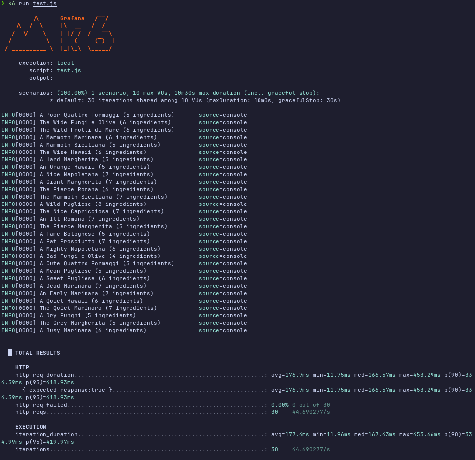

## Exercicio 7.1:


Foram feitos 30 pacotes http_reqs aos quais 0 falharam
avg=176.7ms min=11.75ms med=166.57ms max=453.29ms

## Exercicio 7.2:

```ts
type Cenario {
    vus: numero, // Representa o numero de utilizadores a mandar requests ao mesmo tempo,
    iterations: numero, // numero de pacotes que cada vu manda (todos mandam um em cada iteraçao),
    duration: "stringEscaladeTempo", //inves de iteraçoes, envias pacotes ao longo de Xsegundos,
    target: numero, // começa com o numero atual de vus e durante a duraçao vai ate target vus,
    rate: numero, // numero de pacotese por segundo
}
options = {
    stages: Cenario[]
    OU
    Cenario,
}
```
